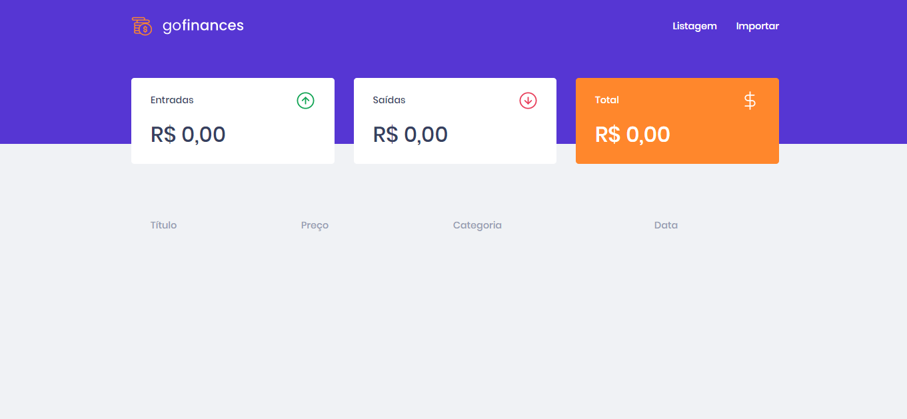
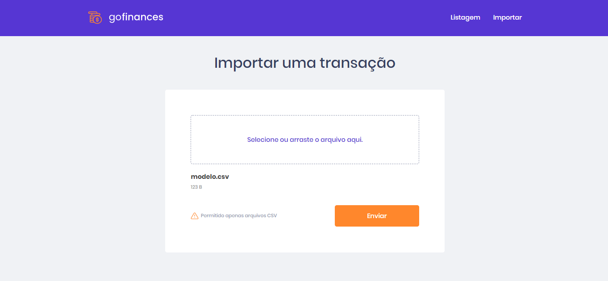
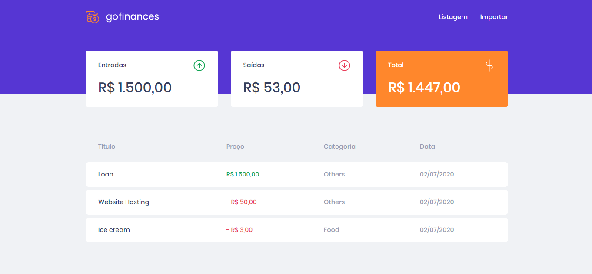

    

    
    
    
    
    
    
    
    
    

  <a href="#-Sobre-o-desafio">🚀 Sobre o desafio</a>&nbsp;&nbsp;&nbsp;|&nbsp;&nbsp;&nbsp;
  <a href="#-Projeto">🚧 Projeto</a>

  <a href="https://github.com/fajzanetti/desafio-database-upload#readme">⬅ Desafio Anterior</a>&nbsp;&nbsp;&nbsp;|&nbsp;&nbsp;&nbsp;🚫

# 🚀 Sobre o desafio

Nesse desafio, você deve continuar desenvolvendo a aplicação de gestão de transações, a GoFinances. Agora você irá praticar o que você aprendeu até agora no React.js junto com TypeScript, utilizando rotas e envio de arquivos por formulário.

Essa será uma aplicação que irá se conectar ao seu backend do Desafio 06, e exibir as transações criadas e permitir a importação de um arquivo CSV para gerar novos registros no banco de dados.

# 🚧 Projeto

---

Desenvolvido com 💚 por [Felipe Zanetti!](https://www.linkedin.com/in/felipezanetti/)
